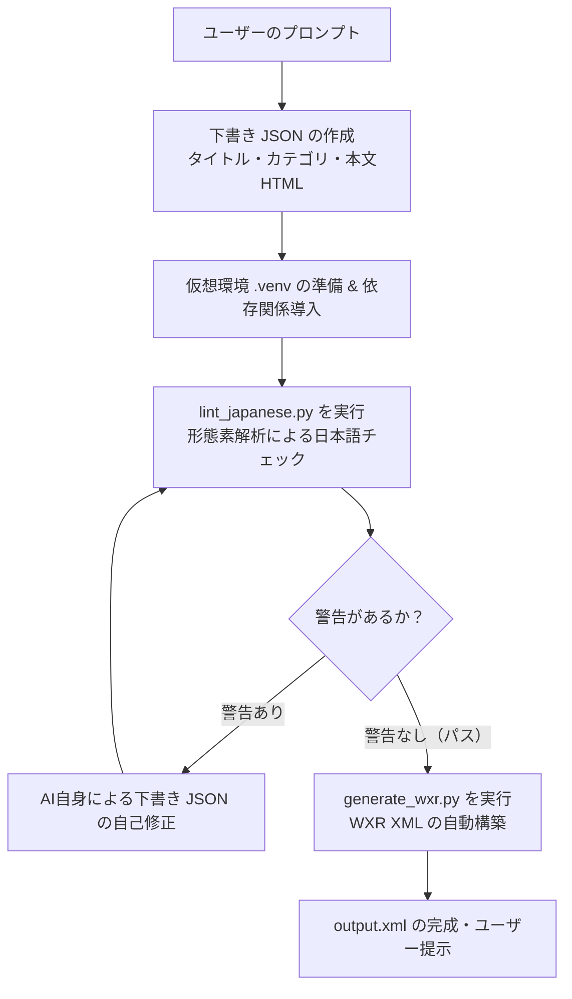

# WordPress WXR 記事生成スキル (WordPress WXR Article Generator)

[](https://agentskills.io/)
[](https://claude.ai/)
[](https://www.python.org/)
[](LICENSE)

WordPress に直接インポート可能な **WXR（WordPress eXtended RSS 1.2 形式）XML ファイル** を自動生成する AI エージェント向けスキルです。

**Claude Code**、**Cursor**、**Antigravity**、**Windsurf** などの主要な AI コーディングエージェントに対応しています。

単に記事本文を出力するだけでなく、形態素解析（SudachiPy）による**日本語品質チェック（Lint）と自己修正ループ**を実行し、AI特有の不自然な表現を自動排除した高品質な記事を生成します。

---

## ✨ 主な特徴

- **WordPress に即インポート可能**: カテゴリ、スラッグ、投稿日時、CDATA 本文を含む正式な WXR (XML) ファイルを出力。WordPress 管理画面の「ツール > インポート」からそのまま取り込めます。
- **形態素解析による日本語品質 Lint**: `sudachipy` を用いて「AI特有の定型句（『〜と言えるでしょう』など）」、「同じ文末の連続（『〜ます』の3連続）」、「1文の長さ（100文字超）」、「文字数不足（800文字未満）」を自動検出し、AI自身が警告が消えるまで自己修正します。
- **構文エラーを防ぐ 2段階生成**: AI に直接 XML を書かせるのではなく、一旦構造化 JSON で下書きを作成したのち、専用の Python スクリプトで XML をビルドするため、タグの閉じ忘れ等の構文エラーが発生しません。
- **独立した仮想環境（venv）**: スキル専用の仮想環境（`.venv`）を自律構築し、依存パッケージのバージョンも厳密に固定しているため、ユーザーのホスト環境を汚さず安定動作します。
- **マルチエージェント対応**: `npx skills add`（Agent Skills 規格）および Claude Code のプラグイン機能（`/plugin`）の両方に完全対応しています。

---

## 📁 ディレクトリ構成

```text
article-generator/
├── skills/
│   └── generate-article/          # 【スキル本体】
│       ├── SKILL.md               # エージェント向け指示書・ワークフロー定義
│       ├── requirements.txt       # 実行用依存パッケージ（バージョン固定）
│       ├── requirements-dev.txt   # テスト用依存パッケージ（pytest）
│       └── scripts/
│           ├── lint_japanese.py   # 形態素解析日本語 Linter スクリプト
│           ├── generate_wxr.py    # JSON → WXR XML 変換スクリプト
│           └── tests/             # ユニットテスト群
│
├── .claude-plugin/                # Claude Code プラグイン定義
│   ├── marketplace.json           # マーケットプレイスカタログ
│   └── plugin.json                # プラグインマニフェスト
│
├── .github/workflows/             # GitHub Actions CI（自動テスト）
│   └── python-test.yml
├── README.md                      # 本ドキュメント
└── package.json
```

---

## 🧩 インストール方法

お使いのエージェント環境に合わせて、以下のいずれかの方法でインストールできます。

### 方法 1: `npx skills add` でインストール（推奨）

Agent Skills オープン規格に対応したツール（Cursor, Claude Code, Antigravity 等）で、ワンコマンドで追加できます：

```bash
# プロジェクト内にインストールする場合
npx skills add ma684351/article-generator

# Claude Code 向けにインストールする場合
npx skills add ma684351/article-generator --agent claude-code

# 全プロジェクトで使えるようグローバルにインストールする場合
npx skills add ma684351/article-generator -g --agent claude-code
```

---

### 方法 2: Claude Code のプラグインとしてインストール

公式マーケットプレイスへの登録なしで、本 GitHub リポジトリから直接 Claude Code にプラグインとしてインストール可能です：

```bash
# 1. リポジトリをマーケットプレイスとして登録（初回のみ）
/plugin marketplace add ma684351/article-generator

# 2. プラグインをインストール
/plugin install generate-article@article-generator

# 3. 反映
/reload-plugins
```

---

### 方法 3: シンボリックリンクによる手動登録

ローカルマシン上の全プロジェクトから即座に利用できるようにする場合：

```bash
# Claude Code の場合
mkdir -p ~/.claude/skills
ln -s "$(pwd)/skills/generate-article" ~/.claude/skills/generate-article

# Cursor / Antigravity の場合
mkdir -p ~/.agents/skills
ln -s "$(pwd)/skills/generate-article" ~/.agents/skills/generate-article
```

---

## 🚀 使い方

スキルをインストールした後は、AI エージェントに対してブログ記事の作成を依頼するだけです。エージェントが自動的にスキルを認識して起動します。

### 指示（プロンプト）の例

- 「**2026年のWeb開発トレンドについて、WordPress用のブログ記事を作成して**」
- 「**初心者向けのPython学習ロードマップに関する記事のWXRファイルを生成して**」
- 「**おすすめのメカニカルキーボードについての記事をWordPressインポート用XMLで出力して**」

### 生成される成果物

エージェントの作業完了後、カレントディレクトリに以下のファイルが生成されます：

- `draft.json`: 記事のタイトル、カテゴリ、スラッグ、HTML本文の下書きデータ
- `output.xml`: WordPress に直接インポート可能な WXR 形式 XML ファイル

### WordPress へのインポート手順

1. WordPress 管理画面にログインします。
2. 左メニューの **「ツール」 > 「インポート」** を開きます。
3. **「WordPress」** のインポーターを実行します（未インストールの場合は「今すぐインストール」をクリック）。
4. 生成された `output.xml` を選択してアップロードします。
5. 投稿者（作成者）を割り当てて実行すると、記事・カテゴリ・スラッグが自動登録されます。

---

## ⚙️ 内部処理ワークフロー

スキルが呼び出されると、エージェントは以下のパイプラインを自律的に実行します：



### チェック項目（`lint_japanese.py`）
1. **文末表現の連続**: 「〜ます。」が3回以上連続していないかチェック
2. **AI特有の禁止語**: 「〜と言えるでしょう」「〜について深掘り」「重要な役割を果たす」などの定型句を検出
3. **一文の長さ**: 1文が100文字を超えて読みづらくなっていないか
4. **記事ボリューム**: 読者に十分な情報を提供できているか（最低800文字以上）

---

## 🧪 開発・テスト

本スキルのスクリプト（Linter および XML 生成）にはユニットテストが用意されています。

```bash
# 依存関係のインストール
pip install -r skills/generate-article/requirements.txt
pip install -r skills/generate-article/requirements-dev.txt

# テストの実行
cd skills/generate-article/scripts
pytest tests/
```

GitHub Actions により、プルリクエストおよび main ブランチへの push 時に自動でテストが実行されます。

---

## 📄 ライセンス

[MIT License](LICENSE)
